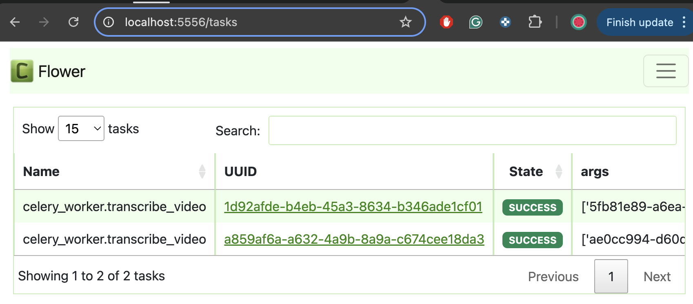

# Product-Review-Transcription-Service

<div style="text-align: justify;">
To track the development process and document key decisions, I maintained a daily development log in documentation/development_logs. Thess logs serve as a quick and unredacted way to organize my thoughts, similar to what I would write down in a notebook. I then use these notes to create the final documentation in a more structured and clear manner.

The real deliverables are:

- [System Design Documentation](documentation/system_design.md)
- [Project Management Documentation](documentation/project_management.md)

# General description

## High-level design


# Intructions

1.  **Build and Launch:**

    - Build and launch the Docker Compose file with:

           ```
           docker-compose -f docker-compose.yaml build
           docker-compose -f docker-compose.yaml up -d
           ```

           and to delete it:

           ```
           docker-compose -f docker-compose.yaml down
           ```

2.  **Access OpenAPI Documentation:**

    - Visit [http://localhost:8001/docs](http://localhost:8001/docs) to explore the OpenAPI documentation, which includes examples ready to use.

3.  **Request a transcription:**

    - Use the `POST` method on `api/video/transcribe` to request a transcription. Refer to the provided example for guidance.

4.  **Get a transcription:**

    - Use the `GET` method on `api/video/transcription/{video_id}` and add the video_id to get the transcription with the metadata.

      **NOTE**:

      - For simulation purposes, the worker will take 20 seconds to prepare the transcription. You can expect the first response to have the metadata but: `transcription:Null` and `transcription_state:'pending'`
      - If the `video_id` does not exist in the db you will get a **404**

## Optional

If you want to further verify the flow of events and inspect the database content, you can use the following services running within the Docker Compose cluster.

5.  **Access the Flower Dashboard:**

    

    - Visit [http://localhost:5556](http://localhost:5556) to access the Flower dashboard. Here, you can monitor the status of the worker and the state of the events a.k.a. tasks (transcriptions).

6.  **PGAdmin Dashboard:**

    Visit [http://localhost:5050](http://localhost:5050) to access PGadmin dashboard, an enter the following data:

    - email: admin@admin.com
    - pw: root

    In Quick Links, press **Add new server**

    - General/ Name = dev
    - Connection/ hostname = db
    - Connection/ Port = 5432
    - Connection/ username = Admin
    - Connection/ pw = Admin

    Once you accessed the server, open the dev db and open the query tool following the image below:

          

    Here, you can monitor the videos and transcription data as they are updated by the worker.
    </div>
