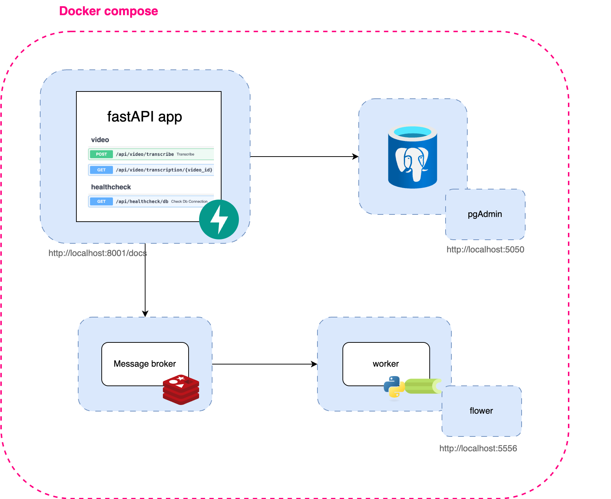
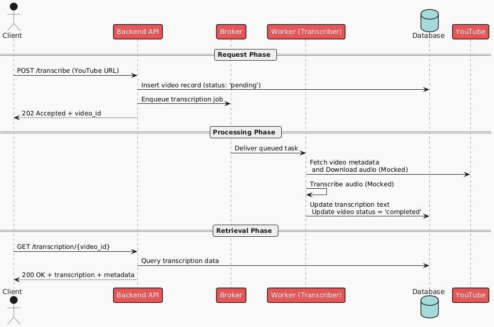
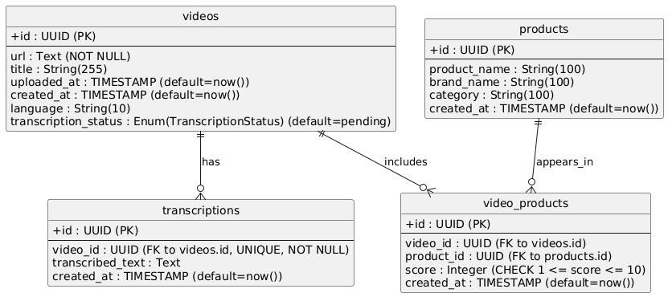

## High-level design



**Backend**: Exposes endpoints to initiate transcriptions and query results.

**Broker**: Handles async communication between services.

**Worker**: Consumes tasks and mocks transcription.

**Database**: Stores video metadata, transcription, and product data.

**PGAdmin**: (Optional) admin tool for inspecting DB.

**Flower**: (Optional) dashboard for inspecting the tasks

## Technology choices

| Component       | Choice         | Reasoning                                                    |
| --------------- | -------------- | ------------------------------------------------------------ |
| Language        | Python         | Familiar, fast prototyping, strong ecosystem                 |
| Web Framework   | FastAPI        | Async support, auto OpenAPI docs, great documentation        |
| Task Queue      | Celery         | Easy to use, scales horizontally, Flower dashboard available |
| Broker          | Redis          | Lightweight, simple setup                                    |
| Database        | PostgreSQL     | Structured queries, full-text search                         |
| Dependency Mgmt | uv             | Modern, fast installs, reproducible environments             |
| Containers      | Docker Compose | Ensures service isolation, easy development and testing      |

I chose a relational database for the MVP due to its focus on transcriptions. PostgreSQL is a strong fit because:

- It is easy to set up and robust.

- It supports full-text search using tsvector, which is ideal for querying transcriptions.

- The data is relatively static, so a relational model is appropriate.

- Structured queries make it easy to retrieve specific information.

- PostgreSQL integrates well with monitoring tools like pgAdmin.

### Scalability Considerations

- Each component runs in its own container for horizontal scalability.

- Celery workers can be scaled independently to handle load.

- PostgreSQL can be clustered with read replicas.

- Redis broker can be replaced with RabbitMQ for more complex routing if needed.

### Error Handling & Resilience

- Tasks are processed asynchronously to prevent blocking the API.

- Failures in the transcription are reflected in the video’s status.

### Assumptions

- One video reviews one product.

- Transcription is mocked for now.

- Polling is used to check status, no WebSockets.

## Flow diagram



The system provides a YouTube transcription service structured into three main phases: Request, Processing, and Retrieval.

1. In the Request Phase, a client sends a transcription request by submitting a YouTube URL to the backend API. The API stores the request in the database with a status of "pending" and enqueues a transcription job via a broker before responding to the client with an accepted status and a video ID.
2. In the Processing Phase, a worker retrieves the job from the broker, fetches the video metadata and audio (mocked), performs transcription (mocked), and updates the database with the resulting text and a status of "completed."
3. In the Retrieval Phase, the client can request the transcription by video ID, prompting the API to fetch the data from the database and return the transcription along with associated metadata.

## Database schema



The system's database schema is centered around four main entities: videos, transcriptions, products, and the junction table video_products. The products table stores product information independently of videos. Although the initial system assumption was that each video would reference a single product, the database was intentionally designed to be more flexible and future-proof. Through the video_products junction table, it supports many-to-many relationships: a video can include multiple products, and the same product can appear in multiple videos. Additionally, each product-video association includes a score from 1 to 10.

For this MVP, I didn't set up any volumes, as I was frequently making changes and found it helpful to start with a clean database each time. This only applies to the data rows—the table structure itself is defined and managed through the models.

## Backend Api: folder structure

The FastAPI project is organized to promote clean separation of concerns and maintainability.

```python
src/backend_api
├── app/
│ ├── routers/ # API route handlers
│ │ └── transcription.py
│ ├── services/ # Business logic
│ │ └── transcription_service.py
│ ├── repositories/ # Database operations
│ │ └── video_repository.py
│ ├── models/ # SQLAlchemy models
│ │ └── models.py
│ ├── schemas/ # Pydantic schemas
│ │ └── transcription_schemas.py
│ ├── celery/ # Celery tasks
│ │ └── transcription_worker_client.py
│ ├── database/ # Database connection
│ │ └── database.py
│ └── main.py # FastAPI app entry point
├── tests/
│ ├── routers/
│ │ └── test_transcription.py
| └── test_main.py
```

The database connections are already managed through dependency injection, which provides a solid foundation for modularity. The next step to improve flexibility is to introduce abstract classes or interfaces, making it easier to replace components like the database or data source in the future without doing significant changes in the codebase.

## Worker

The worker is a lightweight application running in a container. It serves mock data, which is static and remains the same across runs. Development time was minimal; the main focus was ensuring it correctly receives events from the broker and has proper access to the database.
