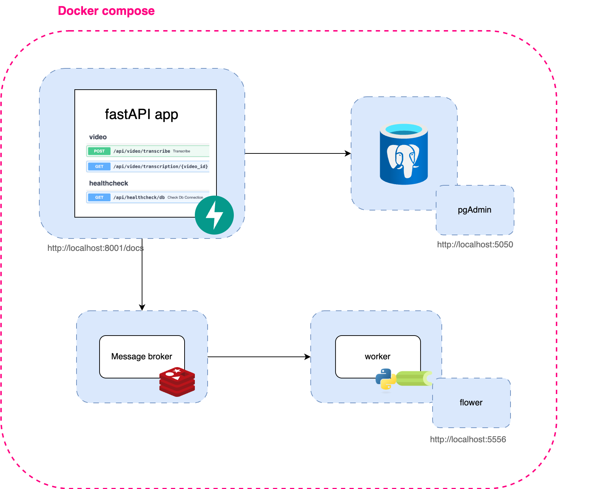
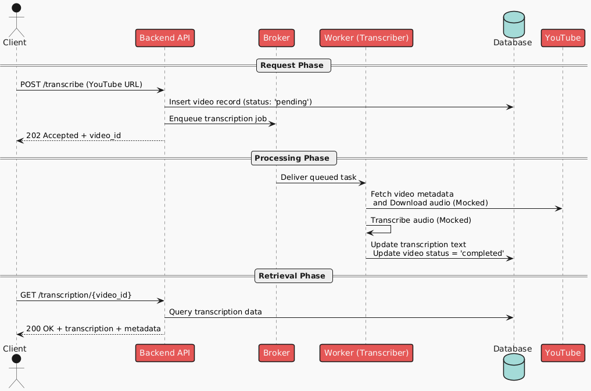
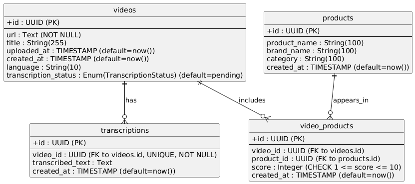

## High-level design



## Flow diagram



## Database schema



## Backend Api: folder structure

```python
src/backend_api
├── app/
│ ├── routers/ # API route handlers
│ │ └── transcription.py
│ ├── services/ # Business logic
│ │ └── transcription_service.py
│ ├── repositories/ # Database operations
│ │ └── video_repository.py
│ ├── models/ # SQLAlchemy models
│ │ └── models.py
│ ├── schemas/ # Pydantic schemas
│ │ └── transcription_schemas.py
│ ├── celery/ # Celery tasks
│ │ └── transcription_worker_client.py
│ ├── database/ # Database connection
│ │ └── database.py
│ └── main.py # FastAPI app entry point
```
